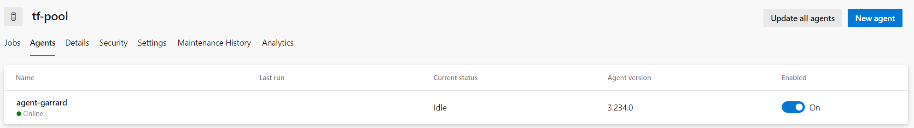

# What does this do?

This Terraform IaC deploys and configures an Azure DevOps self-hosted linux agent that:
- Uses an Azure Storage Account for backend state
- Does not allow blob public access
- Does not allow Shared Key Access
- Uses Managed Identity
- Private Endpoints

In the next release, it will support:

- SA be in a different RG

This is another repo, that you can use, to prove that this deployment is successful:

- [az-tf-sample-iac-that-uses-self-hosted-agent](https://github.com/garrardkitchen/az-tf-sample-iac-that-uses-self-hosted-agent) 

---

# Getting started

## Prerequisite

- You must create a pool in ADO first
- You have created a PAT (in ADO)
- Provide pool name as variable, e.g. `-var="pool_name=<pool_name>"`
- You've a Storage Account with Blob service enabled (allowBlobPublicAccess = false, allowSharedKeyAccess = false) and in the same RG, and a blob container named tfstate

## How to deploy infra and self-hosted agent

**The VM requires ~5 mins to finish configuring; az cli, terraform, install the agent and start as a service**

```powershell
get-date; 
tf apply -var-file="tfvars/uks.tfvars" 
  -var="pat=<ado_pat>" 
  -var="computer_name=garrard" 
  -var="pool_name=tf-pool" 
  -var="agent_name=agent-" 
  -var="pat=<token>"
  -auto-approve; 
get-date
```

Example output:

```
Apply complete! Resources: 11 added, 0 changed, 0 destroyed.

Outputs:

SSH_PRIVATE_KEY = <sensitive>
VM_IP_ADDRESS = "**.***.***.***"
17 February 2024 08:02:03
```

Screenshot of agents in a pool:



---

# Tips on how to problem solve

Download private ssh key and ssh in:

```powershell
$(terraform output -raw SSH_PRIVATE_KEY) > id_rsa.pem
ssh -i id_rsa.pem adminuser@$(terraform output -raw VM_IP_ADDRESS)
```

Output logs:

```powershell
tail -n50 /var/log/cloud-init-output.log
```

---

# Todo

- Private Endpoints (publicNetworkAccess = false) - done
- Allow for SA being in a different RG
- Pass url of agent release into user_data

---